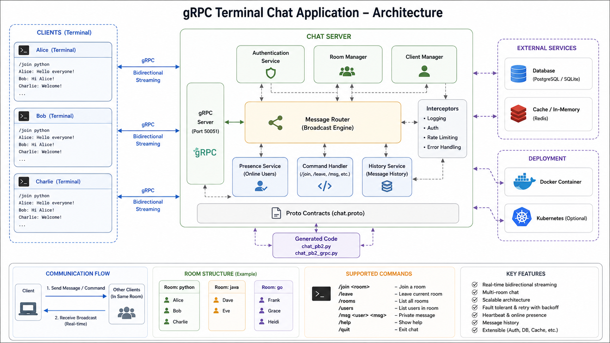

#  gRPC Terminal Chat Application



A real-time, terminal-based chat application built with **Python** and **gRPC Bidirectional Streaming**.

This project is designed as a production-style backend learning project that gradually evolves from a simple Unary RPC application into a scalable distributed chat system.


## 📖 Project Goal

The objective of this project is to understand how real-world chat applications are built using gRPC and distributed system principles.

Instead of building everything at once, the project is developed in multiple phases:

- Learn Protocol Buffers
- Understand gRPC Communication
- Build Unary RPC
- Implement Server Streaming
- Implement Client Streaming
- Build Bidirectional Streaming Chat
- Add Chat Rooms
- Store Message History
- Authentication
- Private Messaging
- Docker Deployment
- Horizontal Scaling

# Features

## Current

- gRPC Server
- Unary RPC
- Protocol Buffers
- Terminal Client
- Client-Server Communication

## Upcoming

- Bidirectional Streaming
- Multiple Chat Rooms
- Presence Service
- Online Users
- Message Broadcasting
- Private Messaging
- Authentication
- SQLite/PostgreSQL
- Redis
- Docker
- Kubernetes
- TLS Encryption

---

# Technology Stack

| Component        | Technology          |
| ---------------- | ------------------- |
| Language         | Python 3.12+        |
| RPC Framework    | gRPC                |
| Serialization    | Protocol Buffers    |
| Database         | SQLite / PostgreSQL |
| Cache            | Redis               |
| Authentication   | JWT                 |
| Containerization | Docker              |
| Orchestration    | Kubernetes          |
| Version Control  | Git                 |
| IDE              | VS Code             |

---

# Project Structure

```text
grpc-chat/

│

├── client/
│   ├── client.py
│   ├── input_handler.py
│   ├── output_handler.py
│
├── server/
│   ├── server.py
│   ├── room_manager.py
│   ├── client_manager.py
│   ├── broadcaster.py
│   ├── auth.py
│   └── history.py
│
├── proto/
│   └── chat.proto
│
├── generated/
│   ├── chat_pb2.py
│   └── chat_pb2_grpc.py
│
├── tests/
│
├── docs/
│   └── architecture.png
│
├── requirements.txt
│
└── README.md
```

---

# Communication Flow

```text
          Client

             │

             ▼

      gRPC Stub

             │

      HTTP/2 + Protobuf

             │

             ▼

        gRPC Server

             │

      Message Router

             │

      Room Manager

             │

      Connected Clients

             │

             ▼

    Broadcast Message
```

---

# Bidirectional Streaming Flow

```text
             Alice

               │

        stream<Message>

               │

               ▼

        gRPC Chat Server

               │

               ▼

        Broadcast Engine

         ┌─────┼─────┐
         │     │     │

       Bob   Charlie David

         ▲     ▲      ▲

         │     │      │

     stream<Message>
```

---

# Chat Commands

| Command               | Description        |
| --------------------- | ------------------ |
| /join <room>          | Join a room        |
| /leave                | Leave current room |
| /rooms                | Show all rooms     |
| /users                | Show online users  |
| /msg <user> <message> | Private message    |
| /history              | Show chat history  |
| /help                 | Display help       |
| /quit                 | Exit application   |

---

# Development Roadmap

## Phase 1

- [x] Project Setup
- [x] Protocol Buffers
- [x] Unary RPC

---

## Phase 2

- [ ] Server Streaming
- [ ] Multiple Requests
- [ ] Streaming Responses

---

## Phase 3

- [ ] Client Streaming

---

## Phase 4

- [ ] Bidirectional Streaming

---

## Phase 5

- [ ] Multiple Clients

---

## Phase 6

- [ ] Chat Rooms

---

## Phase 7

- [ ] Presence Service

---

## Phase 8

- [ ] Private Messaging

---

## Phase 9

- [ ] Authentication

---

## Phase 10

- [ ] SQLite

---

## Phase 11

- [ ] PostgreSQL

---

## Phase 12

- [ ] Redis Cache

---

## Phase 13

- [ ] Docker

---

## Phase 14

- [ ] Kubernetes

---

# Installation

Clone the repository

```bash
git clone https://github.com/yourusername/grpc-chat.git

cd grpc-chat
```

Create a virtual environment

```bash
python -m venv .venv
```

Activate it

Linux/macOS

```bash
source .venv/bin/activate
```

Windows

```bash
.venv\Scripts\activate
```

Install dependencies

```bash
pip install -r requirements.txt
```

---

# Generate gRPC Code

```bash
python -m grpc_tools.protoc \
-I=proto \
--python_out=generated \
--grpc_python_out=generated \
proto/chat.proto
```

---

# Run the Server

```bash
python server/server.py
```

---

# Run the Client

```bash
python client/client.py
```

---

# Example

Client

```text
Username: Alice

Message: Hello Everyone
```

Server

```text
Received

Username : Alice

Message : Hello Everyone
```

Client Response

```text
Hello Alice!
```

---

# Learning Objectives

This project demonstrates:

- Protocol Buffers
- HTTP/2
- RPC Communication
- Bidirectional Streaming
- Distributed Systems Fundamentals
- Concurrency
- Multi-client Networking
- Message Routing
- Backend Architecture
- Production Code Organization

---

# Future Improvements

- WebSocket Gateway
- React Frontend
- File Sharing
- Image Upload
- Voice Messages
- End-to-End Encryption
- Message Reactions
- Typing Indicators
- Read Receipts
- Push Notifications

---

# License

MIT License

---

# Author

**Your Name**

Backend Engineer | Python | gRPC | Distributed Systems

GitHub: https://github.com/yourusername
